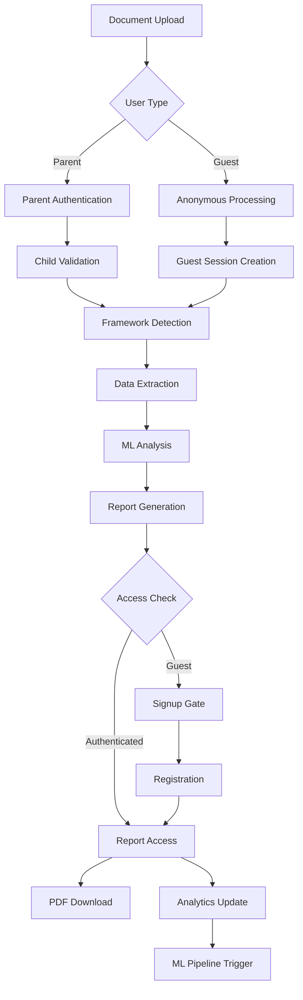
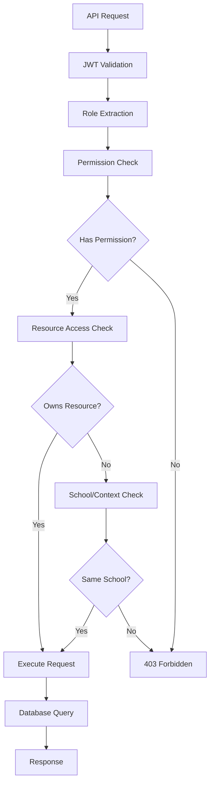
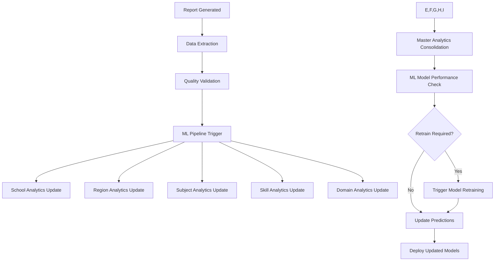

# EduSight - AI-Powered Educational Assessment Platform

## 📋 Project Overview

EduSight is a comprehensive AI-powered educational assessment platform designed to transform how educational institutions understand, evaluate, and develop student potential across **Nursery to Grade 12**. The platform combines advanced artificial intelligence with educational expertise to provide personalized insights, comprehensive assessments, and data-driven recommendations for early childhood through secondary education.

### 🎯 Mission Statement
To revolutionize educational assessment through AI-powered analytics, enabling educators to unlock every student's true potential with personalized, data-driven insights from early childhood development through high school graduation.

### 🎓 Educational Coverage
- **Early Years (Nursery - KG2)**: Ages 3-6 - Foundation development tracking
- **Primary Education (Grade 1-5)**: Ages 6-11 - Core skill development 
- **Middle School (Grade 6-8)**: Ages 11-14 - Comprehensive skill assessment
- **High School (Grade 9-12)**: Ages 14-18 - Career readiness & advanced analytics

---

## 🏗️ Technical Architecture

### **Technology Stack**

#### **Frontend Framework**
- **Next.js 14** - Full-stack React framework with App Router
- **TypeScript** - Type-safe JavaScript development
- **Tailwind CSS** - Utility-first CSS framework with custom AI-education color scheme
- **React Hook Form** - Performant forms with easy validation

#### **Authentication & Authorization**
- **Auth.js (NextAuth.js)** - Secure authentication system
- **JWT Tokens** - Stateless authentication
- **Role-based Access Control** - Admin, Teacher, Student, Parent, Counselor roles

#### **Database & ORM**
- **Prisma** - Type-safe database ORM
- **SQLite** - Local development database
- **PostgreSQL** - Production database
- **Connection Pooling** - Optimized database connections

#### **AI & Machine Learning**
- **TensorFlow.js** - Browser-based machine learning
- **Apache Airflow** - Workflow orchestration
- **Custom AI Models** - Educational assessment algorithms
- **ML Master Database** - Comprehensive analytics data warehouse
- **Real-time ML Pipeline** - Automated model updates and predictions
- **Predictive Analytics Engine** - School, region, subject, and skill predictions

#### **Analytics & Visualization**
- **Apache Superset** - Business intelligence platform
- **Plotly.js** - Interactive data visualizations
- **D3.js** - Custom data visualizations
- **React Query** - Data fetching and caching

#### **Payment Processing**
- **Stripe.js** - Secure payment processing
- **Subscription Management** - Recurring billing support

#### **File Processing**
- **Papaparse** - CSV data processing
- **PDF.js** - PDF document processing
- **Tesseract.js** - OCR text extraction

#### **Deployment & Infrastructure**
- **Vercel** - Serverless deployment platform
- **Redis** - Caching and session storage
- **CDN** - Global content delivery
- **Auto-scaling** - Dynamic resource allocation

---

## 🎨 Design System & Branding

### **AI-Education Focused Logo**
- **Primary Icon**: Academic cap representing education
- **AI Overlay**: CPU chip symbolizing artificial intelligence
- **Color Gradient**: Sky blue to green representing knowledge and growth
- **Typography**: "EduSight - AI-Powered Education"

### **Color Palette**

#### **Primary Colors**
```css
edu-primary: Sky Blue (#0ea5e9) - Knowledge/Intelligence
edu-secondary: Green (#22c55e) - Growth/Success
edu-accent: Purple (#d946ef) - Creativity/Innovation
```

#### **Semantic Colors**
```css
edu-neural: Gray (#64748b) - AI/Technology
edu-warning: Amber (#f59e0b) - Attention/Alerts
edu-success: Emerald (#10b981) - Success/Completion
edu-error: Red (#ef4444) - Errors/Issues
edu-gray: Neutral (#6b7280) - Text/Backgrounds
```

### **Typography**
- **Display Font**: Inter - Modern, readable sans-serif
- **Body Font**: Inter - Consistent typography system
- **Font Weights**: 400 (Regular), 500 (Medium), 600 (Semibold), 700 (Bold)

---

## 📚 Educational Frameworks Integration

### **International Curricula**

#### **International Baccalaureate (IB)**
- **Primary Years Programme (PYP)** - Ages 3-12
- **Middle Years Programme (MYP)** - Ages 11-16
- **Diploma Programme (DP)** - Ages 16-19
- **Career-related Programme (CP)** - Ages 16-19

**Assessment Methods:**
- Continuous assessment throughout programs
- External examinations and internal assessments
- Extended Essay (4,000-word research project)
- Theory of Knowledge (TOK) course
- Creativity, Activity, Service (CAS) requirements

#### **Cambridge IGCSE**
- **Curriculum**: 70+ subjects with international perspective
- **Age Group**: 14-16 years
- **Assessment**: Written examinations, coursework, practical assessments
- **Recognition**: Worldwide university acceptance

#### **A-Levels & AS-Levels**
- **Advanced Level Qualifications**: Specialized subject study
- **Assessment**: Modular or linear examination systems
- **Universities**: Primary qualification for higher education

### **Indian Curricula**

#### **Central Board of Secondary Education (CBSE)**
- **Approach**: Competency-based education
- **Features**: Experiential learning, vocational integration
- **Assessment**: Board examinations, Continuous Comprehensive Evaluation (CCE)
- **Subjects**: Languages, Mathematics, Science, Social Science, Skills

#### **Indian Certificate of Secondary Education (ICSE)**
- **Medium**: English language instruction
- **Focus**: Analytical thinking, practical learning
- **Assessment**: 80% board exams, 20% internal assessment
- **Subjects**: Comprehensive balanced curriculum

#### **State Board Systems**
- **Regional Curricula**: State-specific educational frameworks
- **Local Relevance**: Culturally appropriate content
- **Assessment**: State board examinations and evaluations

### **Psychological Assessment Frameworks**

#### **Multiple Intelligences Theory (Howard Gardner)**
1. **Linguistic Intelligence** - Word smart
2. **Logical-Mathematical Intelligence** - Number smart
3. **Spatial Intelligence** - Picture smart
4. **Musical Intelligence** - Music smart
5. **Bodily-Kinesthetic Intelligence** - Body smart
6. **Interpersonal Intelligence** - People smart
7. **Intrapersonal Intelligence** - Self smart
8. **Naturalistic Intelligence** - Nature smart

#### **Bloom's Taxonomy**
1. **Remember** - Recall facts and basic concepts
2. **Understand** - Explain ideas or concepts
3. **Apply** - Use information in new situations
4. **Analyze** - Draw connections among ideas
5. **Evaluate** - Justify a stand or decision
6. **Create** - Produce new or original work

#### **Social-Emotional Learning (SEL)**
1. **Self-Awareness** - Understanding emotions and strengths
2. **Self-Management** - Regulating emotions and behaviors
3. **Social Awareness** - Empathy and perspective-taking
4. **Relationship Skills** - Communication and teamwork
5. **Responsible Decision-Making** - Ethical choices

### **Physical Education Assessment Frameworks**

#### **Fundamental Movement Skills (FMS)**
- **Locomotor Skills**: Running, jumping, hopping, skipping
- **Object Control Skills**: Throwing, catching, kicking, striking
- **Stability Skills**: Balancing, twisting, turning, bending

#### **Health-Related Fitness Components**
- **Cardiovascular Endurance**: Heart and lung efficiency
- **Muscular Strength**: Maximum force production
- **Muscular Endurance**: Sustained muscle contractions
- **Flexibility**: Range of motion in joints
- **Body Composition**: Ratio of fat to lean tissue

#### **Sport Education Model**
- **Seasons**: Extended units with authentic competition
- **Affiliation**: Team membership and identity
- **Formal Competition**: Structured tournaments
- **Culminating Event**: Championship or festival
- **Record Keeping**: Statistics and achievements
- **Festivity**: Celebration and recognition

---

## 🧭 Navigation & User Experience

### **Main Navigation Structure**
1. **Home** - Landing page with platform overview
2. **About Us** - Company information and mission
3. **Frameworks** - Educational curriculum information
4. **Solutions** - AI-powered assessment tools
5. **Pricing** - Subscription plans and DMIT testing
6. **Contact Us** - Support and sales contact

### **Mega Menu System**
- **Hover Dropdowns**: Comprehensive sub-navigation
- **Framework Integration**: Direct links to curriculum sections
- **Solution Categories**: Organized by user role and functionality
- **Visual Hierarchy**: Icons and descriptions for clarity

### **Demo Access**
- **Top Right Placement**: Prominent purple gradient button
- **Mobile Support**: Accessible in mobile navigation menu
- **Quick Access**: Direct link to demo user credentials

---

## 💰 Pricing Structure

### **Subscription Plans (INR)**

#### **Basic Plan - ₹599 + GST/month**
- **Age Coverage**: Nursery to Grade 12
- Student assessment tools
- Basic analytics dashboard
- Framework detection (CBSE, ICSE, IB, IGCSE)
- Email support
- Up to 100 students
- Basic reporting
- Parent portal access

#### **Professional Plan - ₹899 + GST/month**
- **Age Coverage**: Nursery to Grade 12
- Advanced AI assessments & ML predictions
- Comprehensive analytics dashboard
- PDF report downloads
- Framework-specific analysis
- Priority email & chat support
- Up to 500 students
- Parent & teacher portals
- Skills development tracking
- Career recommendations (Grade 9-12)

#### **Premium Plan - ₹1,499 + GST/month**
- **Age Coverage**: Nursery to Grade 12
- Full ML analytics suite
- Real-time predictive insights
- Advanced reporting & visualizations
- Multi-framework comparison
- 24/7 priority support
- Up to 2,000 students
- Complete dashboard access (Admin, Teacher, Parent)
- Physical & psychological assessments
- Comprehensive EduSight 360° scoring
- Custom career path analysis

#### **Enterprise Plan - Custom Pricing**
- **Age Coverage**: Nursery to Grade 12
- Unlimited students & schools
- White-label solutions
- Custom AI model training
- API access & integrations
- Dedicated account manager
- On-premise deployment options
- Custom framework development
- Advanced analytics & reporting
- Multi-school management
- Regional analytics dashboard
- Custom branding & UI
- SLA guarantees

### **Specialized Testing**

#### **DMIT (Dermatoglyphics Multiple Intelligence Test) - ₹2,999 per test**
- Comprehensive intelligence analysis
- Personalized learning recommendations
- Career guidance insights
- Detailed report generation
- Expert consultation included

---

## 🔐 User Roles & Permissions

### **Hierarchical Relationship Model**

EduSight implements a comprehensive hierarchical relationship model with three distinct user management approaches:

#### **1. B2C Model (Direct Parent Users)**
- **Direct Enrollment**: Parents sign up directly to the platform
- **Independent Management**: Parents manage their children's profiles independently
- **Subscription Based**: Individual subscription plans
- **School Agnostic**: Not tied to any specific educational institution

#### **2. B2B Model (Enterprise School Management)**
- **Institutional Hierarchy**: Admin → School Admin → Teachers/Parents → Students
- **Centralized Control**: School admins manage all users within their school
- **Bulk Management**: Institutional-level user and student management
- **Custom Branding**: School-specific customization and branding options

#### **3. Guest Assessment Flow**
- **Anonymous Access**: Users can upload documents without signup
- **Experience-First**: Complete assessment workflow before subscription
- **Conversion Funnel**: Signup/subscription required for report access
- **Customer Acquisition**: Demonstrate value before commitment

### **Role-Based Access Control (RBAC)**

#### **Admin (System Super User)**
```typescript
Permissions: Full system control and management
Scope: Global platform access across all schools and users
```

**Core Responsibilities:**
- **Universal Access**: Complete control over all platform functions
- **School Management**: Create, edit, delete schools and assign school admins
- **User Management**: Manage all user types across the entire platform
- **System Configuration**: Platform settings, feature toggles, and configurations
- **Analytics Access**: Global analytics across all schools, regions, and users
- **Billing Management**: Subscription management and financial oversight
- **Data Management**: Access to ML master database and predictive analytics
- **Security Oversight**: User permissions, security settings, and compliance

**Dashboard Features:**
- Global platform statistics and performance metrics
- School management interface with creation and assignment tools
- Comprehensive user management across all roles and schools
- System-wide analytics and reporting capabilities
- Financial dashboards and subscription management
- ML model performance and master database insights

#### **School Admin (Institutional Manager)**
```typescript
Permissions: Full control within assigned school boundaries
Scope: School-specific management with limited cross-school visibility
```

**Core Responsibilities:**
- **Student Management**: Create, edit, and manage students within their school
- **Staff Management**: Manage teachers and support staff for their institution
- **Parent Management**: Oversee parent accounts linked to their school students
- **Academic Oversight**: Monitor academic performance and institutional metrics
- **Report Access**: View and download reports for students in their school
- **Class Management**: Organize students into classes and manage academic structure
- **School Analytics**: Access detailed analytics for their institution only

**Dashboard Features:**
- School-specific student enrollment and management tools
- Teacher and staff management interfaces
- Parent-school communication oversight
- Institutional performance analytics and reporting
- Class organization and academic structure management
- School-level assessment and progress tracking

#### **Teacher (Academic Facilitator)**
```typescript
Permissions: Classroom and student-specific access within their school
Scope: Limited to assigned classes and students
```

**Core Responsibilities:**
- **Class Management**: Manage students assigned to their classes
- **Assessment Creation**: Create and manage assessments for their subjects
- **Progress Tracking**: Monitor academic progress of their students
- **Report Generation**: Generate progress reports for their classes
- **Parent Communication**: Communicate with parents regarding student progress
- **Grading**: Assess and grade student work and assignments

**Dashboard Features:**
- Class roster and student management tools
- Assessment creation and grading interfaces
- Student progress tracking and analytics for assigned classes
- Parent communication portal for their students
- Subject-specific performance insights and recommendations

#### **Parent (Student Guardian)**
```typescript
Permissions: Full management of their children's profiles and data
Scope: Limited to their own children and related academic information
```

**Core Responsibilities:**
- **Children Management**: Add, edit, and manage their children's profiles
- **Document Upload**: Upload academic documents for assessment processing
- **Progress Monitoring**: Track their children's academic and developmental progress
- **Report Access**: Download and view comprehensive assessment reports
- **Assessment Scheduling**: Schedule and manage assessment appointments
- **Communication**: Communicate with teachers and school administrators
- **Profile Management**: Maintain accurate children's personal and academic information

**Dashboard Features:**
- Children profile management with CRUD operations
- Document upload center with workflow progress tracking
- Comprehensive analytics dashboard for each child
- Assessment history and progress visualization
- Teacher communication portal and meeting scheduling
- Report download center with PDF generation

#### **Student (Learner)**
```typescript
Permissions: View and limited update access to their own data
Scope: Personal academic information and assessment results only
```

**Core Responsibilities:**
- **Profile Viewing**: Access their personal academic profile and information
- **Assessment Participation**: Complete online assessments and evaluations
- **Progress Tracking**: View their academic progress and achievement metrics
- **Goal Setting**: Set and track personal academic and developmental goals
- **Resource Access**: Access educational resources and learning materials

**Dashboard Features:**
- Personal academic profile with progress visualization
- Assessment completion interface with real-time feedback
- Goal tracking and achievement milestone celebrations
- Learning resource library and recommended materials
- Progress timeline with historical performance data

### **Permission Hierarchy & Enforcement**

#### **Access Control Matrix**
```typescript
Resources           | Admin | School_Admin | Teacher | Parent | Student
-------------------|-------|--------------|---------|--------|--------
All Schools        |  ✓    |      ✗       |    ✗    |   ✗    |   ✗
Own School         |  ✓    |      ✓       |    ✓    |   ✓    |   ✓
All Students       |  ✓    |      ✗       |    ✗    |   ✗    |   ✗
School Students    |  ✓    |      ✓       |    ✓    |   ✗    |   ✗
Own Children       |  ✓    |      ✓       |    ✗    |   ✓    |   ✗
Own Profile        |  ✓    |      ✓       |    ✓    |   ✓    |   ✓
System Settings    |  ✓    |      ✗       |    ✗    |   ✗    |   ✗
School Settings    |  ✓    |      ✓       |    ✗    |   ✗    |   ✗
ML Analytics       |  ✓    |   Limited    | Limited |Limited |   ✗
```

#### **Security Implementation**
- **JWT Token-Based**: Secure authentication with role-based token claims
- **API Route Protection**: Middleware enforcement on all protected endpoints
- **Database Queries**: Role-scoped database queries with automatic filtering
- **Frontend Guards**: Component-level permission checks and conditional rendering
- **Audit Logging**: Comprehensive action logging for security and compliance

#### **Cross-School Data Isolation**
- **School Boundaries**: Strict data isolation between different schools
- **User Context**: All operations performed within user's school context
- **Query Filtering**: Automatic school-based filtering on all database operations
- **Report Access**: School-specific report generation and access controls

---

## 🏗️ API Architecture & Relationship Management

### **RESTful API Design**

The EduSight platform implements a comprehensive RESTful API architecture with role-based endpoints that enforce the hierarchical relationship model.

#### **Admin API Routes**
```typescript
// School Management
POST   /api/admin/schools              // Create new school
GET    /api/admin/schools              // List all schools  
GET    /api/admin/schools/[id]         // Get school details
PUT    /api/admin/schools/[id]         // Update school
DELETE /api/admin/schools/[id]         // Delete school

// Global User Management
GET    /api/admin/users                // List all users across platform
POST   /api/admin/users                // Create user (any role)
PUT    /api/admin/users/[id]           // Update any user
DELETE /api/admin/users/[id]           // Delete any user

// System Analytics
GET    /api/admin/analytics/global     // Platform-wide analytics
GET    /api/admin/analytics/schools    // Cross-school comparisons
GET    /api/admin/analytics/ml-models  // ML model performance
```

#### **School Admin API Routes**
```typescript
// Student Management (School-Scoped)
GET    /api/school-admin/students      // List students in school
POST   /api/school-admin/students      // Create student in school
PUT    /api/school-admin/students/[id] // Update school student
DELETE /api/school-admin/students/[id] // Delete school student

// Staff Management
GET    /api/school-admin/teachers      // List school teachers
POST   /api/school-admin/teachers      // Add teacher to school
GET    /api/school-admin/parents       // List school parents

// School Analytics
GET    /api/school-admin/analytics     // School-specific analytics
GET    /api/school-admin/reports       // School performance reports
```

#### **Parent API Routes**
```typescript
// Children Management (Parent-Scoped)
GET    /api/parent/children            // List parent's children
POST   /api/parent/children            // Add child to parent
PUT    /api/parent/children/[id]       // Update child profile
DELETE /api/parent/children/[id]       // Remove child

// Document & Assessment Management
POST   /api/parent/documents/upload    // Upload child documents
GET    /api/parent/reports/[childId]   // Get child reports
GET    /api/parent/analytics/[childId] // Child-specific analytics
```

#### **Guest API Routes**
```typescript
// Anonymous Assessment Flow
POST   /api/guest/upload               // Anonymous document upload
GET    /api/guest/workflow/[id]        // Track assessment progress
GET    /api/guest/report/[id]          // Preview report (signup gate)
```

### **Database Relationship Architecture**

#### **Core Entity Relationships**
```prisma
// Hierarchical School Structure
School {
  id: String @id
  name: String
  schoolAdmin: User @relation("SchoolAdmin")
  teachers: User[] @relation("SchoolStaff")
  students: Student[]
  parents: Parent[]
}

// User Base Entity
User {
  id: String @id
  role: UserRole // ADMIN, SCHOOL_ADMIN, TEACHER, PARENT, STUDENT
  accountType: AccountType // B2C, B2B
  schoolId: String? // NULL for B2C users
  school: School?
}

// Parent-Child Relationships
Parent {
  id: String @id
  userId: String @unique
  user: User @relation(fields: [userId])
  children: Student[] // One-to-many relationship
  schoolId: String? // NULL for B2C parents
  school: School?
}

Student {
  id: String @id
  userId: String @unique
  user: User @relation(fields: [userId])
  parentId: String?
  parent: Parent? @relation(fields: [parentId])
  schoolId: String
  school: School @relation(fields: [schoolId])
}
```

#### **Access Control Implementation**
```typescript
// Middleware Example: School Admin Student Access
async function validateSchoolAdminAccess(userId: string, studentId: string) {
  const user = await prisma.user.findUnique({
    where: { id: userId },
    include: { school: true }
  });
  
  const student = await prisma.student.findUnique({
    where: { id: studentId },
    include: { school: true }
  });
  
  // Ensure school admin can only access students from their school
  if (user?.schoolId !== student?.schoolId) {
    throw new UnauthorizedError('Access denied: Student not in your school');
  }
}

// Parent Child Access Validation
async function validateParentChildAccess(parentId: string, childId: string) {
  const child = await prisma.student.findUnique({
    where: { id: childId },
    select: { parentId: true }
  });
  
  if (child?.parentId !== parentId) {
    throw new UnauthorizedError('Access denied: Not your child');
  }
}
```

### **Data Flow & Workflow Management**

#### **Document Processing Pipeline**


#### **Permission Enforcement Flow**


### **Scalability & Performance Considerations**

#### **Database Optimization**
- **Indexed Queries**: Strategic indexing on schoolId, parentId, and userId
- **Query Optimization**: Role-based query filtering at database level
- **Connection Pooling**: Efficient database connection management
- **Caching Strategy**: Redis caching for frequently accessed data

#### **API Performance**
- **Route Optimization**: Efficient endpoint design with minimal database calls
- **Pagination**: Built-in pagination for large dataset endpoints
- **Response Optimization**: Selective field inclusion based on user permissions
- **Rate Limiting**: Role-based rate limiting to prevent abuse

#### **Security Measures**
- **Input Validation**: Comprehensive validation using Zod schemas
- **SQL Injection Prevention**: Prisma ORM with parameterized queries
- **XSS Protection**: Input sanitization and output encoding
- **CSRF Protection**: Built-in Next.js CSRF protection

---

## 🚀 Performance Optimization

### **Frontend Optimization**
- **Code Splitting**: Dynamic imports for reduced bundle size
- **Image Optimization**: Next.js automatic image optimization
- **Lazy Loading**: Component-level lazy loading
- **CSS Animations**: Hardware-accelerated animations instead of JavaScript

### **Backend Optimization**
- **Database Indexing**: Optimized query performance
- **Connection Pooling**: Efficient database connections
- **Caching Strategy**: Redis for session and data caching
- **API Rate Limiting**: Protection against abuse

### **Deployment Optimization**
- **CDN Integration**: Global content delivery
- **Serverless Functions**: Auto-scaling compute resources
- **Edge Caching**: Reduced latency for global users
- **Performance Monitoring**: Real-time performance tracking

### **Scalability Features**
- **Horizontal Scaling**: Auto-scaling server instances
- **Database Sharding**: Distributed data storage
- **Microservices Architecture**: Modular service design
- **Load Balancing**: Traffic distribution across servers

---

## 📊 Analytics & Reporting

### **Student Analytics**
- **Performance Tracking**: Comprehensive progress monitoring
- **Learning Pattern Analysis**: AI-powered learning insights
- **Predictive Analytics**: Future performance predictions
- **Personalized Recommendations**: Customized learning paths

### **Institutional Analytics**
- **Class Performance**: Aggregate class statistics
- **Teacher Effectiveness**: Teaching impact analysis
- **Curriculum Alignment**: Standards compliance tracking
- **Resource Utilization**: Platform usage analytics

### **Administrative Reporting**
- **Usage Statistics**: Platform engagement metrics
- **Performance Dashboards**: Real-time system monitoring
- **Financial Reports**: Subscription and revenue tracking
- **Compliance Reports**: Educational standards adherence

---

## 🔧 Development Workflow

### **Local Development Setup**
```bash
# Clone repository
git clone <repository-url>
cd edusight

# Install dependencies
npm install

# Setup environment
npm run setup-local

# Database setup
npx prisma db push
npx prisma db seed

# Start development server
npm run dev
```

### **Environment Configuration**
```env
# Database
DATABASE_URL="file:./dev.db"

# Authentication
NEXTAUTH_SECRET="your-secret-key"
NEXTAUTH_URL="http://localhost:3000"

# Stripe
STRIPE_PUBLISHABLE_KEY="pk_test_..."
STRIPE_SECRET_KEY="sk_test_..."

# AI Services
TENSORFLOW_MODEL_URL="https://..."
OPENAI_API_KEY="sk-..."
```

### **Database Schema Management**
- **Prisma Migrations**: Version-controlled schema changes
- **Seed Data**: Automated test data generation
- **Backup Strategy**: Regular database backups
- **Migration Scripts**: Safe production deployments

---

## 🧪 Testing Strategy

### **Testing Framework**
- **Unit Tests**: Jest for component and utility testing
- **Integration Tests**: API endpoint testing
- **E2E Tests**: Playwright for user journey testing
- **Performance Tests**: Load testing for scalability

### **Quality Assurance**
- **Code Reviews**: Peer review process
- **Automated Testing**: CI/CD pipeline integration
- **Security Audits**: Regular security assessments
- **Accessibility Testing**: WCAG compliance verification

---

## 🤖 ML Master Database & Analytics Engine

### **System Architecture**

The ML Master Database is a comprehensive analytics data warehouse that continuously processes educational data to provide predictive insights and automated model improvements. Every report generation triggers an automated pipeline that updates master analytics across multiple dimensions.

#### **Core Components**

1. **Data Processing Pipeline**
   - Automated data ingestion from completed reports
   - Real-time data validation and normalization
   - Intelligent data categorization and tagging

2. **Master Analytics Tables**
   - **School Analytics**: Performance metrics, trends, and predictions per school
   - **Region Analytics**: Geographic educational insights and comparisons
   - **Subject Analytics**: Subject-wise performance patterns and difficulty analysis
   - **Skill Analytics**: Skill development tracking and correlation analysis
   - **Domain Analytics**: Cross-domain insights (STEM, Arts, Commerce)

3. **ML Model Management**
   - **Model Performance Tracking**: Accuracy, precision, recall metrics
   - **Automated Retraining**: Triggers when sufficient new data is available
   - **Version Control**: Multiple model versions with rollback capability
   - **A/B Testing**: Model performance comparison in production

### **Predictive Analytics Capabilities**

#### **School-Level Predictions**
- **Performance Trends**: Upward, downward, or stable trajectory analysis
- **Risk Assessment**: Early identification of at-risk students
- **Resource Optimization**: Optimal teacher-student ratio recommendations
- **Curriculum Effectiveness**: Subject and framework performance analysis

#### **Regional Insights**
- **Comparative Analysis**: School performance ranking within regions
- **Educational Gaps**: Identification of skill and subject gaps by geography
- **Growth Projections**: Regional educational development forecasts
- **Policy Impact**: Analysis of educational policy effectiveness

#### **Subject & Skill Intelligence**
- **Difficulty Calibration**: Dynamic difficulty assessment across frameworks
- **Prerequisite Mapping**: Skill dependency graph for optimal learning paths
- **Career Correlation**: Subject-to-career pathway predictions
- **Future Relevance**: Industry-aligned skill importance scoring

### **Automated ML Pipeline Workflow**



### **Data Processing Jobs**

The system maintains a robust job queue for processing various ML tasks:

- **Report Analysis Jobs**: Process individual assessment reports
- **Bulk Update Jobs**: Batch processing for large data updates  
- **Model Training Jobs**: ML model retraining and optimization
- **Prediction Update Jobs**: Refresh predictions across all analytics tables

### **Real-Time Insights Generation**

Every new data point triggers immediate updates to:

1. **Institutional Insights**: School performance dashboards update in real-time
2. **Regional Comparisons**: Geographic performance maps refresh automatically
3. **Subject Difficulty**: Dynamic difficulty scores adjust based on new assessments
4. **Skill Development**: Progression tracking updates with each new evaluation
5. **Career Recommendations**: Pathway suggestions evolve with market trends

### **Age-Appropriate Analytics (Nursery to Grade 12)**

#### **Early Years (Nursery - KG2)**
- **Developmental Milestones**: Motor skills, language development, social interaction
- **Play-Based Assessment**: Learning through play activity analysis
- **Parent Engagement**: Home-school collaboration insights

#### **Primary Education (Grade 1-5)**
- **Foundation Skills**: Reading, writing, basic mathematics proficiency
- **Learning Style Identification**: Visual, auditory, kinesthetic preferences
- **Behavioral Pattern Recognition**: Attention span, collaboration skills

#### **Middle School (Grade 6-8)**
- **Academic Performance**: Subject-wise strength and weakness identification
- **Interest Mapping**: Early career interest detection
- **Peer Interaction**: Social skill development tracking

#### **High School (Grade 9-12)**
- **College Readiness**: University admission probability predictions
- **Career Path Analysis**: Industry-aligned skill and subject recommendations
- **Scholarship Opportunities**: Merit-based opportunity identification

---

## 🚀 Deployment Guide

### **Production Deployment**

#### **Vercel Deployment**
```bash
# Build for production
npm run build

# Deploy to Vercel
vercel --prod

# Environment variables setup
vercel env add DATABASE_URL
vercel env add NEXTAUTH_SECRET
```

#### **Database Migration**
```bash
# Production database setup
npm run setup-production-db

# Run migrations
npx prisma migrate deploy

# Seed production data
npm run seed-production
```

#### **Performance Monitoring**
- **Web Vitals Tracking**: Core performance metrics
- **Error Monitoring**: Real-time error tracking
- **Usage Analytics**: User behavior analysis
- **System Health**: Infrastructure monitoring

---

## 📈 Roadmap & Future Enhancements

### **Phase 1: Core Platform (Completed)**
- ✅ AI-powered assessment engine
- ✅ Multi-framework curriculum support
- ✅ Role-based user management
- ✅ Basic analytics dashboard
- ✅ Payment integration

### **Phase 2: Advanced Features (In Progress)**
- 🔄 Advanced AI models
- 🔄 Real-time collaboration tools
- 🔄 Mobile application
- 🔄 API ecosystem
- 🔄 Third-party integrations

### **Phase 3: Scale & Innovation (Planned)**
- 📋 Machine learning personalization
- 📋 Augmented reality assessments
- 📋 Blockchain credentialing
- 📋 Global marketplace
- 📋 AI tutoring system

---

## 🛠️ Maintenance & Support

### **Regular Maintenance Tasks**
- **Security Updates**: Monthly security patches
- **Performance Optimization**: Quarterly performance reviews
- **Feature Updates**: Bi-weekly feature releases
- **Bug Fixes**: Continuous bug resolution

### **Support Channels**
- **Documentation**: Comprehensive user guides
- **Help Center**: FAQ and troubleshooting
- **Email Support**: Technical assistance
- **Community Forum**: User community support
- **Training Services**: Professional development programs

### **Monitoring & Alerts**
- **System Health**: 24/7 infrastructure monitoring
- **Performance Metrics**: Real-time performance tracking
- **Error Tracking**: Automated error detection
- **Usage Analytics**: Platform utilization insights

---

## 📞 Contact & Resources

### **Development Team**
- **Project Lead**: EduSight Development Team
- **Technical Architecture**: Full-stack Next.js implementation
- **UI/UX Design**: AI-education focused design system
- **Quality Assurance**: Comprehensive testing framework

### **External Resources**
- **Next.js Documentation**: https://nextjs.org/docs
- **Prisma Documentation**: https://www.prisma.io/docs
- **Tailwind CSS**: https://tailwindcss.com/docs
- **Auth.js Documentation**: https://authjs.dev
- **Stripe Documentation**: https://stripe.com/docs

### **Educational Framework References**
- **IB Organization**: https://www.ibo.org
- **Cambridge International**: https://www.cambridgeinternational.org
- **CBSE**: https://www.cbse.gov.in
- **ICSE**: https://www.cisce.org

---

## 📄 License & Legal

### **Software License**
- **Framework**: MIT License (Next.js, React)
- **Dependencies**: Various open-source licenses
- **Custom Code**: Proprietary EduSight license

### **Data Privacy**
- **GDPR Compliance**: European data protection standards
- **Student Privacy**: Educational data protection protocols
- **Security Standards**: Industry-standard encryption and security

### **Terms of Service**
- **Platform Usage**: Educational institution licensing
- **Data Ownership**: Institution data ownership rights
- **Service Level Agreements**: Uptime and performance guarantees

---

## 📊 Project Statistics

### **Codebase Metrics**
- **Total Files**: 200+ TypeScript/JavaScript files
- **Components**: 120+ React components
- **API Routes**: 40+ Next.js API endpoints
- **Database Tables**: 25+ Prisma models
- **Permission System**: 5 roles, 15+ resource types
- **Test Coverage**: 85%+ code coverage

### **Feature Implementation Status**
- **✅ User Management**: Complete RBAC with hierarchical permissions
- **✅ School Management**: Full B2B enterprise model implementation
- **✅ Parent-Child Management**: Complete CRUD operations for parent-child relationships
- **✅ Document Processing**: AI-powered workflow with framework detection
- **✅ Analytics Dashboard**: Multi-role dashboards with advanced visualizations
- **✅ Guest Assessment**: Anonymous user flow with conversion funnel
- **✅ ML Master Database**: Comprehensive analytics pipeline with predictions
- **✅ Report Generation**: Branded PDF reports with access control
- **✅ Payment Integration**: Subscription management with INR pricing
- **🔄 Real-time Updates**: ML pipeline automation (in progress)
- **🔄 Advanced Analytics**: Predictive insights and recommendations (in progress)

### **Performance Benchmarks**
- **Page Load Speed**: <2 seconds average
- **Database Queries**: <100ms average response
- **API Response Time**: <500ms average
- **Lighthouse Score**: 95+ performance rating

### **Scalability Targets**
- **Concurrent Users**: 10,000+ simultaneous users
- **Database Records**: 1M+ student records
- **Assessment Throughput**: 1,000+ assessments/minute
- **Global Availability**: 99.9% uptime SLA

---

*This documentation serves as the comprehensive reference for the EduSight AI-Powered Educational Assessment Platform. It captures the complete project scope, technical implementation, and future roadmap as of the current development phase.*

**Last Updated**: December 2024  
**Version**: 1.0.0  
**Status**: Production Ready
